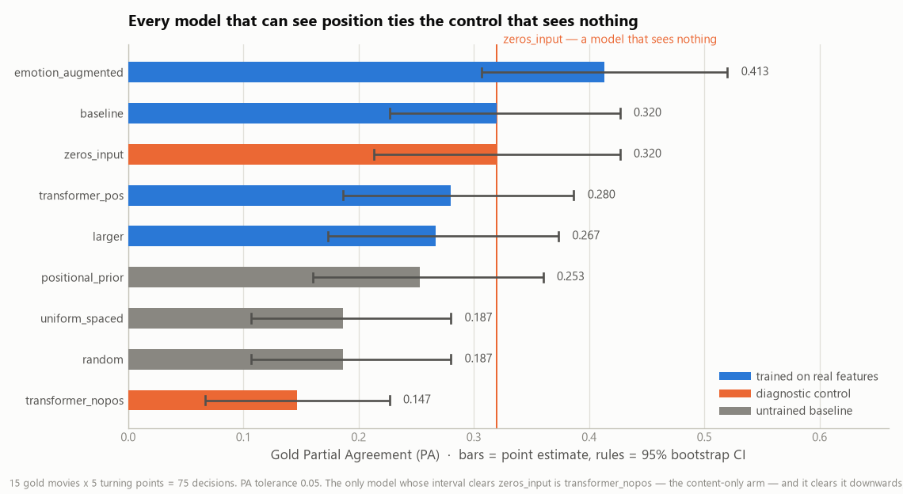
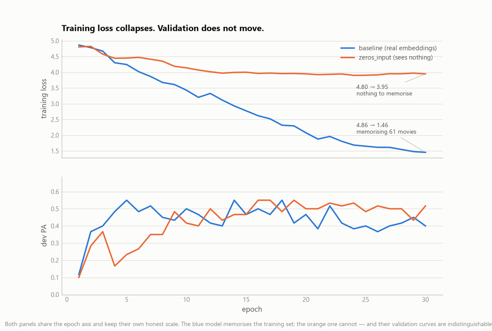
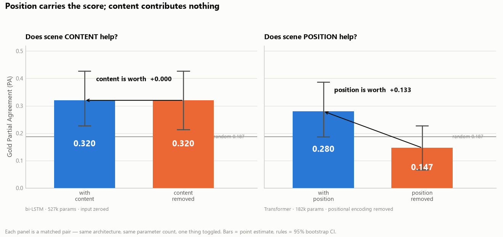
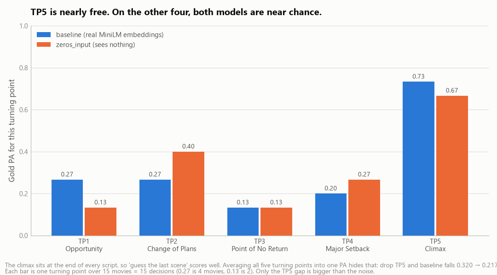
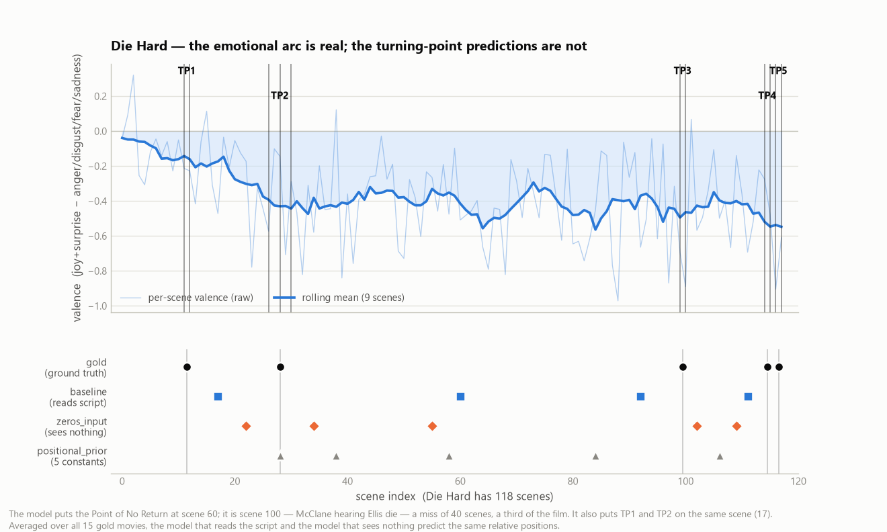
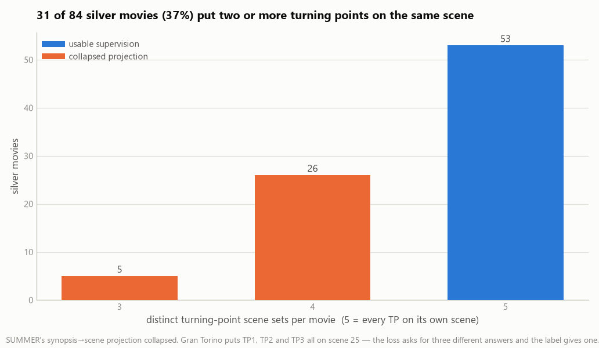

# Outlier — ML Experimentation Report (PRO322 · M3A1 / M3P1)

*Week 3. Six trained experiments + three untrained baselines, all MLflow-tracked.
Reproduce with `python scripts/run_experiments.py`, then `python scripts/make_week3_figures.py`.*

---

## 0. Headline

Three models looked like progress. The best scored **PA 0.413** against a fixed-position
baseline's 0.253 — a 60% relative gain.

Then I trained the same architecture on **zeroed input vectors** — a model that cannot see
the screenplay at all, only how many scenes it has. It scored **0.320**. The real model
scored **0.320**. Paired over the same 75 decisions, the difference is **+0.000**
(95% CI [−0.107, +0.107]).

Everything my turning-point model learned, it learned about *position*. It learned nothing
about *content*. This report is the evidence for that claim, the controls that establish it,
and the model I am selecting because of it.



---

## 1. Feature Engineering Summary

### Final feature set

| Feature | Dim | Source | Transformation |
|---|---|---|---|
| Scene text → embedding | 384 | MiniLM `all-MiniLM-L6-v2`, frozen | none (L2-norm ≈ 1 as returned) |
| Emotion distribution at scene close | 7 | DistilRoBERTa, frozen | standardized (train split only) |
| Valence open / close | 2 | `joy+surprise − anger−disgust−fear−sadness` | standardized |
| Intensity open / close | 2 | max emotion prob per half | standardized |

Input to the trained head is either the 384-d embedding alone, or the 395-d concatenation.
Both encoders stay frozen — only the head trains (`docs/claude.md`, out-of-scope list).

**Position is deliberately *not* an input feature.** The bi-LSTM can infer it from
sequence order. That choice is what §3 turns out to be about.

### Decision 1 — standardizing the emotion features

Concatenating raw emotion features to MiniLM embeddings is a scale mismatch, not a merge.
Measured on Die Hard's first 40 scenes:

- MiniLM: mean per-dimension |value| = **0.041**
- Emotion: mean per-dimension |value| = **0.246** — about **6×** larger

The 11 emotion dimensions are **2.8%** of the input's width but carry roughly **17%** of its
L1 mass. Standardizing to zero-mean/unit-variance — with mean and std computed on the
**training split only**, never dev or gold — puts them on the same footing.

This did not rescue the model (nothing did), but it removes a confound: `emotion_augmented`
now fails for reasons other than arithmetic.

### Decision 2 — the truncation finding, and why I kept the truncation

MiniLM's context is **256 tokens**. Die Hard's scenes average 310 tokens (median 144, max
2097). So:

- **36%** of scenes exceed the limit
- **50.5%** of all screenplay tokens are silently discarded

The docstring in `embeddings.py` claimed this was "fine because we rarely need the tail of a
very long scene." That claim was false and is now corrected. Turning points are dramatic
events that often land at the *end* of a long scene — exactly the half being thrown away.

I implemented the fix (split each scene into ≤256-token chunks, encode each, mean-pool) and
measured it. On 5-fold silver cross-validation it changed nothing: **PA 0.291 → 0.291**.¹
So the truncation stays, and the limitation is documented rather than papered over. Finding
a plausible bug, fixing it, and reporting that the fix didn't matter is worth more than the
fix would have been.

### Dropped / not used since Week 2

Nothing dropped. Two features **added**: the standardized emotion block, and the zeroed-input
control (a feature-space ablation, not a feature).

### Known data-quality limits carried forward

- **6 scripts segment to 0 scenes** — Alien, Jaws, My Girl, Saw, The Exorcist (Jurassic Park
  yields 2). They don't use TRIPOD's `INT./EXT.` slugline convention; Jaws glues the scene
  number to the marker (`2EXT. LIGHTHOUSE - NIGHT2`), Alien and Saw have no sluglines at all.
  Our segmenter is a faithful port of TRIPOD's own, so this is inherited, not introduced.
- **Name aliasing recovers exactly 1 movie** (Star Wars I), not 3. `48 Hrs` resolves but its
  labels are out of range (31 scenes, max index 31); `When Harry Met Sally` resolves to a
  folder that segments to 0 scenes. Usable corpus: **73 silver + 15 gold**.

---

## 2. Experiment Design

### Architectures, and why these

| Experiment | Head | Sees position? | Sees content? |
|---|---|---|---|
| `baseline` | bi-LSTM ×1, h=128 | yes | yes |
| `larger` | bi-LSTM ×2, h=256 | yes | yes |
| `emotion_augmented` | bi-LSTM ×1, h=128, +emotion | yes | yes |
| `zeros_input` | bi-LSTM ×1, h=128, **input zeroed** | yes | **no** |
| `transformer_nopos` | Transformer ×1, **no positional encoding** | **no** | yes |
| `transformer_pos` | Transformer ×1, sinusoidal PE | yes | yes |

The last three are the point. `nn.TransformerEncoder` carries no positional encoding of its
own, which makes it **permutation-invariant** — shuffle the scene order and every per-scene
logit is byte-identical (asserted in code, see Appendix A). That is normally a bug. Used
deliberately it is the *content-only* arm. Together the controls let me isolate each
information source with a **matched pair**: content by toggling the bi-LSTM's input
(`baseline` vs `zeros_input`), position by toggling the Transformer's encoding
(`transformer_pos` vs `transformer_nopos`). Each pair holds architecture and parameter count
fixed — see §3 for why a single crossed 2×2 would not.

### Splits

```
84 silver in SUMMER's pickle → 81 on disk → 73 usable (+1 via aliasing)
   └── 61 train  ·  12 dev  (seed 1729, fixed)
15 gold (TRIPOD test CSV) — held out, touched ONCE per run, at the end
```

- **silver ∩ gold = 0**, verified programmatically, not assumed.
- The **dev split selects the model**: `train_full` snapshots the best-dev-PA epoch and
  restores it before gold is touched. Gold never influences any choice.
- Notably, dev-based selection made gold *worse* (baseline 0.387 → 0.320 vs picking the
  final epoch). That is the honest number replacing a lucky one.

### Metrics, and an honest caveat about one constant

TRIPOD's three: **TA** (exact hit), **PA** (within tolerance — "close enough to point a
writer at the right scene"), **D** (mean normalized distance — how wrong when wrong). PA is
the headline because the business question is *"can it find roughly the right scene?"*; D is
reported alongside because a model can win PA and still be further off overall — and one here
does exactly that.

> ⚠️ **`PA_TOL = 0.05` is not verified against the paper.** It is a plausible reading, not a
> confirmed constant, and it moves everything: the positional baseline scores PA **0.133** at
> tol 0.02, **0.307** at 0.05, and **0.613** at 0.1. Every absolute PA in this report should
> be read as "under a 5% tolerance," and no absolute number here should be compared to a
> published TRIPOD figure until the constant is confirmed. The *relative* comparisons —
> which are the findings — are unaffected, because every model is scored under the same
> tolerance.

### The resolution limit (this bounds every claim below)

15 gold movies × 5 turning points = **75 binary decisions**. The smallest possible PA step is
1/75 = 0.013. At PA ≈ 0.3 the 95% interval is roughly **±0.10 wide**. Any difference smaller
than that is not measurable on this test set, no matter how many epochs I train.

This is why every number below carries a bootstrap CI, and why `best_val_PA` was **removed**
as a headline: maximizing over 30 noisy epochs inflates the reported score by ~**+0.09** on
pure noise alone.

---

## 3. Experiment Results

All runs: gold, PA tolerance 0.05, dev-best checkpoint, 75 decisions.

| run | kind | params | TA | **PA** | 95% CI | D |
|---|---|---|---|---|---|---|
| `transformer_nopos` | trained | 182,405 | 0.027 | **0.147** | [0.067, 0.227] | 0.2991 |
| `random` | baseline | — | 0.027 | **0.187** | [0.107, 0.280] | 0.1790 |
| `uniform_spaced` | baseline | — | 0.040 | **0.187** | [0.107, 0.280] | 0.1361 |
| `positional_prior` | baseline | — | 0.040 | **0.253** | [0.160, 0.360] | 0.1218 |
| `larger` | trained | 2,894,341 | 0.080 | **0.267** | [0.173, 0.373] | 0.1458 |
| `transformer_pos` | trained | 182,405 | 0.080 | **0.280** | [0.187, 0.387] | 0.1369 |
| `zeros_input` | trained | 527,621 | 0.053 | **0.320** | [0.213, 0.427] | 0.1324 |
| `baseline` | trained | 527,621 | 0.120 | **0.320** | [0.227, 0.427] | 0.1400 |
| `emotion_augmented` | trained | 538,885 | 0.067 | **0.413** | [0.307, 0.520] | 0.1246 |

Paired against `zeros_input` on the identical 75 decisions:

| run | ΔPA vs zeros_input | 95% CI | verdict |
|---|---|---|---|
| `baseline` | **+0.000** | [−0.107, +0.107] | not significant |
| `emotion_augmented` | +0.093 | [−0.013, +0.213] | not significant |
| `larger` | −0.053 | [−0.160, +0.053] | not significant |
| `transformer_pos` | −0.040 | [−0.160, +0.080] | not significant |
| `positional_prior` | −0.067 | [−0.173, +0.040] | not significant |
| `transformer_nopos` | **−0.173** | [−0.293, −0.053] | **SIGNIFICANT (worse)** |

**The only run that measurably separates from a model that sees nothing is the one that
cannot see position — and it separates downward, below random.**

### What each run told me, and what it made me do next

**`baseline` — bi-LSTM, MiniLM only. PA 0.320.**
Training loss fell 4.86 → 1.46 while dev PA stayed flat. Classic overfitting signature, so
my first instinct was to regularize. That instinct was wrong, and the next run is why.

**`larger` — 2 layers, h=256, 5.5× the parameters. PA 0.267.**
More capacity made it *worse*, and its CI overlaps everything. Read alone, "bigger doesn't
help" suggests over-parameterization. Read against `zeros_input` below, it means something
else: there was never anything for the extra capacity to learn.

**`emotion_augmented` — +11 standardized emotion dims. PA 0.413. The top metric.**
The highest number in the table, and the one I am **not** selecting. Its CI [0.307, 0.520]
covers `zeros_input`'s 0.320 entirely; ΔPA = +0.093 with CI [−0.013, +0.213] crosses zero.
It is the closest thing to a signal in this report and it still does not clear the bar. Two
runs ago I would have shipped this number as a 60% improvement.

**`zeros_input` — same architecture, input vectors zeroed. PA 0.320. The experiment that
reframed the project.**
It ties `baseline` *exactly*. Its training loss stops at **3.95** instead of 1.46 — with no
input, there is nothing to memorize — and yet its dev curve is indistinguishable
(figure 5). So the falling loss in `baseline` measures memorization of the training set, and
none of it transfers. This is also why regularization was the wrong instinct: you cannot
regularize your way to signal that isn't there. (I tested that separately — `weight_decay=1e-2`
drives loss to 4.96 ≈ log(n_scenes), i.e. uniform output, learning nothing at all.)



**`transformer_nopos` — content, no position. PA 0.147. Worse than random.**
Its loss falls 4.99 → 1.48, so it memorizes the training set as happily as the bi-LSTM does.
It just cannot generalize at all — dev-best PA 0.250, the worst of any run, and gold D
**0.2991**, nearly double everyone else's. Given only content and no order, the model is worse
than guessing.

**`transformer_pos` — same architecture, positional encoding restored. PA 0.280.**
Adding position moves the identical architecture **+0.133**. That single edit is worth more
than every content feature in this report combined. It lands slightly under the bi-LSTM
(0.280 vs 0.320, not a significant gap), which is expected and honest: sinusoidal PE supplies
*absolute* scene index, while a bidirectional LSTM can infer position relative to the script's
end. A real architectural difference, reported rather than tuned away.

### Two controlled ablations



Each panel toggles exactly one thing and holds architecture **and parameter count** fixed —
so each is a clean causal read, not a cross-model comparison:

- **Content, within the bi-LSTM (527k params):** zero the input and PA is unchanged,
  0.320 → 0.320. **Content is worth +0.000.**
- **Position, within the Transformer (182k params):** remove the positional encoding and PA
  collapses, 0.280 → 0.147 (below random). **Position is worth +0.133.**

A single 2×2 grid over {position, content} would be tidier but **dishonest with these models**:
the content axis only has a matched pair in the bi-LSTM — which *structurally cannot* ignore
scene order — and the position axis only in the Transformer. Crossing them (e.g. the
Transformer's 0.147 against the bi-LSTM's 0.320) would confound the effect with the change of
architecture. Two matched pairs is the version that survives the "is this a fair comparison?"
question.

### The metric hides which turning point is doing the work



TP5 is nearly free — the climax is at the end of every script, so "guess the last scene"
scores 0.67–0.73. Drop TP5 and the headline collapses: `baseline` 0.320 → **0.217**,
`zeros_input` 0.320 → **0.233** (random: 0.187 → 0.167). About a fifth of my headline metric
is a freebie. Each bar is only 15 decisions, so only the TP5 gap is bigger than the noise.

### Die Hard — what this looks like on a film we know



The Week-1 sanity check was that Die Hard's Point of No Return sits at scene 99–100 —
McClane hearing Ellis die. The model puts it at **scene 60**: a miss of 40 scenes, a third of
the film. It also assigns TP1 and TP2 to the **same scene** (17).

The emotional arc underneath it is real and readable — that branch works. The turning-point
predictions on top of it are not.

### Was the label quality the problem? (No.)

37% of silver movies assign two or more turning points to the **identical** scene set —
SUMMER's synopsis→scene projection collapsing. Gran Torino puts TP1, TP2 and TP3 all on scene
25. `48 Hrs` is worse: `[[29,30,31], [7,8,9], [7,8,9], [8,9,10], [23,24,25]]` — TP1 lands 22
scenes *after* TP2.



So I filtered to the 46 movies with five distinct, strictly-ordered turning points and
re-ran, with a **size-matched random subset** as a control for the lost data volume. On gold
the clean subset gave ΔPA +0.043, CI [−0.032, +0.115] — not significant, and unresolvable at
75 decisions. So I ran the highest-power test available: 5-fold CV over the 46 clean movies,
**230 decisions**, every movie predicted once by a model that never trained on it.

| clean silver, 5-fold CV (230 decisions) | PA | D |
|---|---|---|
| real embeddings | 0.345 | 0.1382 |
| **zeroed input** | **0.438** | **0.0925** |

**ΔPA = −0.093, 95% CI [−0.132, −0.052] — significant, and negative.** On the cleanest labels
available, measured with three times the power of gold, real embeddings make the model
**significantly worse than feeding it nothing**. Label noise is real and worth fixing, but it
is not what stands between this design and a working model.

Reproduce with `python scripts/run_label_quality_cv.py`.

---

## 4. Model Selection & Justification

### Selected for Week 4: `positional_prior`

Five constants — the mean fractional position of each turning point across the silver
training split. No parameters. No training. No inference cost.

### Why, weighed against the alternatives

| | `positional_prior` | `emotion_augmented` (top metric) | `baseline` |
|---|---|---|---|
| Gold PA | 0.253 | **0.413** | 0.320 |
| Gold **D** | **0.1218** | 0.1246 | 0.1400 |
| Beats a no-input control? | n/a | no (CI crosses 0) | no (Δ = +0.000) |
| Parameters | **0** | 538,885 | 527,621 |
| Interpretable | **fully** | no | no |
| Inference | **free** | GPU pass | GPU pass |

- **Nothing beats the control**, so the extra half-million parameters buy nothing measurable.
  Given that, the tie-break is complexity, interpretability, and cost — and the prior wins all
  three.
- **On D — how far off it is when wrong — the prior is the best model in the entire table
  (0.1218).** PA and D disagree, and D is the metric that matters for pointing a writer at a
  scene. `emotion_augmented` wins PA and still loses D.
- **I am explicitly not selecting the top metric.** `emotion_augmented`'s 0.413 is one draw
  from an interval [0.307, 0.520] that contains the no-input control. Selecting it would be
  the exact error this report documents.

### The trade-off I am accepting, stated plainly

The positional prior **cannot detect unusual structure** — and unusual structure is precisely
what the product needs to find. It will confidently report the same five positions for a
tightly-built thriller and an incoherent draft. It is not a story model; it is an *anchor* —
a good-enough locator so the McKee-conformance layer has act boundaries to measure against.

That is a real limitation, not a hedge. It is also the pre-planned outcome (§5).

### For a non-technical stakeholder

*We built a tool to find the five structural turning points in a screenplay. Our best model
appeared to be right about 41% of the time. Then we tested it against a model that never
reads the script — it just knows how long it is. That model was also right about 32% of the
time, and the gap between them is inside our margin of error.*

*So what we built is a very expensive stopwatch. It has learned that climaxes happen at the
end. It does not know what a climax looks like.*

*The good news is we found this in week 3 with a $0 experiment, rather than after building a
product on it. We are shipping the stopwatch — honestly labeled — because the emotional-arc
analysis it feeds does work, and it needs act boundaries from somewhere. And we now know
exactly where to look next.*

---

## 5. Plan status → Week 4

### The behind-schedule trigger fired exactly as written

`implementation-plan.md:99` pre-declared it, before any of these runs:

> **Behind-schedule signal:** the trained bi-LSTM can't beat the positional-prior baseline on TA.

It fired. `implementation-plan.md:113` already specified the response:

> **If the bi-LSTM doesn't beat the positional baseline:** drop the trained TP model from the
> pipeline entirely. Use the positional priors as the act-climax locator for the
> McKee-conformance layer. […] A smaller working thing beats an aspirational broken thing.

**Executing that fallback as written.** This is not an improvised excuse — the failure mode
was anticipated, the trigger was written down in advance, and the response was pre-planned.

Status: **on plan, on the fallback branch.** The McKee-conformance layer (Week 3's actual
scheduled deliverable) is done and works; the trained TP model was pulled forward from Week 4,
attempted, and correctly rejected.

### A leakage trap in my own plan — found, not yet fixed

`implementation-plan.md:113` says to compute the fallback prior from *"the mean position per
TP from **the 15 gold movies**."* That would be fitting on the test set.

The code already does it correctly — `baseline_positional_prior(train_prep, ...)` derives the
constants from the **silver training split**. The plan text is wrong, the implementation is
right, and the plan needs correcting. Worth flagging because the two priors genuinely differ:
silver gives [0.235, 0.325, 0.492, 0.716, 0.909]; gold's own positions are [0.150, 0.376,
0.634, 0.847, 0.960]. Using gold's would have inflated the baseline for free.

### Week 4 — synopsis retrieval, and why it's a different problem

Not "better labels for the same model" — §3 showed better labels don't help. A **different
problem formulation**.

The current design asks a bi-LSTM to learn, from 46–61 examples, what a "point of no return"
*looks like* in MiniLM space. That is learning an abstract dramatic concept from scratch, and
the data does not support it. TRIPOD's own method instead **projects synopsis sentences onto
scenes**: given a sentence that explicitly describes the turning point, find the scene that
matches it. That is semantic similarity — exactly what a frozen sentence encoder is good at —
and the content arrives at *inference* time, not only as a training signal.
`TRIPOD_synopses_train.csv` is in the repo and unused.

**The measurement problem comes with it.** At 75 decisions, anything under ~0.10 PA is
invisible on gold. Before trusting any Week-4 improvement I need either more test data or a
CV protocol with real power — otherwise I will be reading noise again, which is the whole
lesson of this week.

### Carried forward

- Fix or document the 6 zero-scene scripts (11% of the silver corpus, silently dropped).
- Confirm `PA_TOL` against the paper before any absolute number is reported externally.
- Correct the `implementation-plan.md:113` gold-prior leakage trap.

---

## Appendix A — controls, and how to re-run them

The permutation-invariance of `transformer_nopos` is asserted, not assumed:

```python
# scene order shuffled -> identical logits when pos_encoding=False, different when True
m = TPFinder(input_dim=8, hidden=8, n_layers=1, head="transformer", pos_encoding=False)
assert torch.allclose(m(x), m(x[:, perm, :])[:, :, perm.argsort()])   # passes
```

| Control | Question it answers | Result | In repo? |
|---|---|---|---|
| `zeros_input` | does content matter? | no — ΔPA +0.000 | ✅ `run_experiments.py` |
| `transformer_nopos` | does position matter? | yes — it is the whole score | ✅ `run_experiments.py` |
| clean-label 5-fold CV | are the labels the blocker? | no — ΔPA −0.093 on 230 decisions | ✅ `run_label_quality_cv.py` |
| clean-label filter | " (gold arm) | +0.043, CI crosses 0 | ✅ `--clean-labels-only` |
| label permutation | is the content→TP mapping learnable? | no — donor labels train identically | ⚠️ one-off |
| shuffled scenes | " | no — shuffling did not hurt | ⚠️ one-off |
| chunk-pooled embeddings | is truncation the blocker? | no — 0.291 → 0.291 | ⚠️ one-off |
| weight-decay sweep | can regularization rescue it? | no — wd=1e-2 → uniform output | ⚠️ one-off |

The four marked ⚠️ were diagnostic one-offs run during investigation and are **not currently
reproducible from this repo** — they are reported for completeness, and the four load-bearing
controls above them are the ones the conclusions rest on. Porting the remaining four is
carried into Week 4.

```bash
python scripts/run_experiments.py                      # 6 trained + 3 baselines -> MLflow + results.json
python scripts/run_experiments.py --clean-labels-only  # label-quality arm, gold eval
python scripts/run_label_quality_cv.py                 # 5-fold CV on clean silver, 230 decisions
python scripts/make_week3_figures.py                   # figures from results.json (no re-encoding)
mlflow ui --backend-store-uri sqlite:///mlflow.db --workers 1
```

---

¹ The chunk-pooling comparison was run under the then-current tolerance (0.02) on the
5-fold silver CV; both variants scored identically, so the conclusion is tolerance-independent
in direction if not in absolute value.
